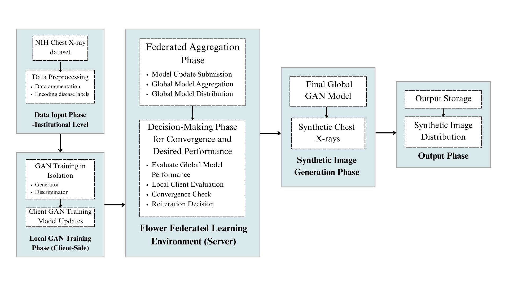
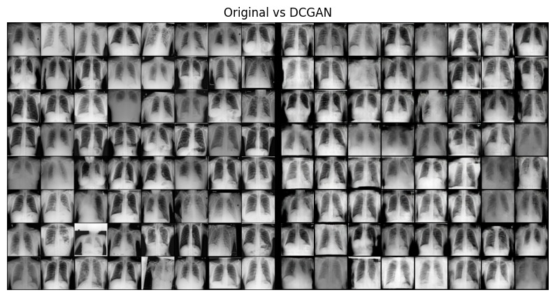
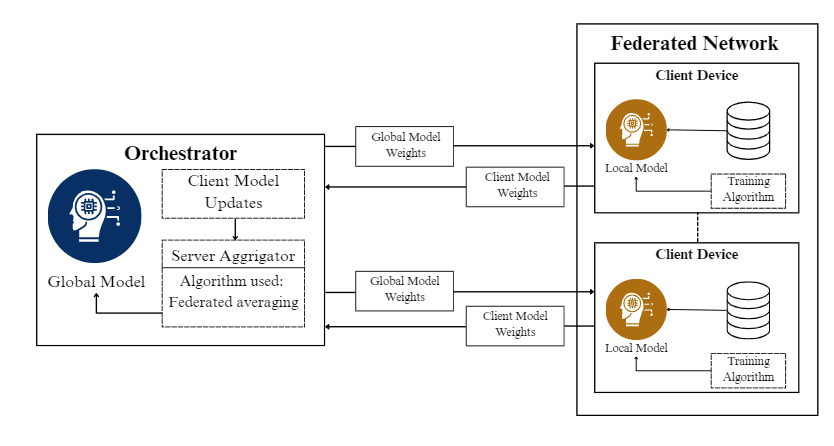

# MedSynGAN: A Federated GAN System for Generating Synthetic Medical Images

## 🧠 Overview

**MedSynGAN** is a Federated Generative Adversarial Network (GAN) system for privacy-preserving generation of synthetic **chest X-ray images**. It integrates **federated learning** with advanced GAN architectures such as **DCGAN**, **ProGAN**, and **StyleGAN2/3** to overcome medical data scarcity, ensure data privacy, and boost generalizability across diverse healthcare institutions.

## 🏥 Motivation

Medical data is scarce, siloed, and governed by strict privacy regulations (HIPAA, GDPR). Traditional GAN training on centralized data is not viable in healthcare. **MedSynGAN** addresses:

- **Data scarcity** through synthetic image generation
- **Data privacy** with federated learning and encryption
- **Diversity and generalization** by training across multiple hospitals

## 🎯 Objectives

- Generate realistic synthetic chest X-ray images
- Maintain strict patient data privacy
- Enable collaborative AI training across hospitals
- Evaluate image quality using clinical metrics (FID, SSIM, PSNR)

---

## 🚀 Key Features

- 🌐 **Federated Learning** using [Flower](https://flower.dev/)
- 🧠 **GAN Architectures**:
  - DCGAN: Deep Convolutional GAN ([Paper](https://arxiv.org/abs/1511.06434))
  - ProGAN: Progressive GAN by NVIDIA ([NVIDIA](https://research.nvidia.com/publication/2018-02_Progressive-Growing-of))
  - StyleGAN2/3: High-fidelity image synthesis ([GitHub](https://github.com/NVlabs/stylegan3))
- 🔐 **Privacy**:
  - Differential privacy
  - AES-256 encryption
  - Secure aggregation
- 📊 **Evaluation Metrics**: FID, SSIM, PSNR, MSE, PPL

---

## 📂 Dataset

- **NIH Chest X-ray Dataset**: 112,120 frontal X-rays, 30,805 patients, 14 disease categories
- Preprocessing: 224×224 or 256×256 resolution, normalization, histogram equalization
- Data augmentation: Random flips, rotations, zooms

---

## 📈 Performance

| Metric      | Value (Best Case)     |
|-------------|------------------------|
| FID         | 26.71                  |
| SSIM        | 0.85                   |
| PSNR        | 51.29 dB               |
| MSE         | ≤ 0.012                |

---

## 📸 Image Quality Samples

> **Fig:** Sample outputs from MedSynGAN-trained models

---

## 🧠 Architecture

- **Clients**: Train GANs locally on private datasets
- **Server**: Aggregates model updates via Federated Averaging (FedAvg)
- **No data leaves the institution**

---

## 🔐 Privacy-Preserving Framework

1. **Differential Privacy** (ε=1.0)
2. **AES-256 Encryption** for model updates
3. **Secure Aggregation**
4. **Gradient Clipping + Parameter Quantization**
5. **TLS-based Authentication**

---

## 🧪 Experimental Results

| Image # | FID Score | SSIM | MSE | PSNR |
|---------|-----------|------|-----|------|
| 1       | 253.24    | 0.843 | 0.493 | 51.44 |
| 2       | 262.05    | 0.851 | 0.493 | 51.38 |
| 3       | 262.71    | 0.851 | 0.496 | 51.29 |

> Performance is evaluated across several metrics for realism, structure, and noise levels.

---

## 📉 Limitations

- Degraded performance for rare pathologies (<1% data)
- Sensitivity to medical devices and non-standard poses
- Communication overhead increases with >5 clients
- Resolution drops quality at 1024×1024

---

## 🔄 Future Directions

- GAN architectures focused on rare pathologies
- Adaptive client-server update scheduling
- Integration with segmentation annotations
- Multi-modal image synthesis (e.g., X-ray + CT)

---

## 📚 References

- [ProGAN - NVIDIA](https://research.nvidia.com/publication/2018-02_Progressive-Growing-of)
- [DCGAN Paper](https://arxiv.org/abs/1511.06434)
- [StyleGAN2](https://github.com/NVlabs/stylegan2)
- [StyleGAN3](https://github.com/NVlabs/stylegan3)
- [NIH Chest X-ray Dataset](https://nihcc.app.box.com/v/ChestXray-NIHCC)

---

## 👨‍⚕️ Authors

- Chinmay Inamdar
- Arya Doshi
- Swadha Joshi
- Swati Shilaskar  
**Vishwakarma Institute of Technology, Pune**

> *This project is a research contribution towards synthetic medical image generation with privacy guarantees, made available for academic and development use.*

---

